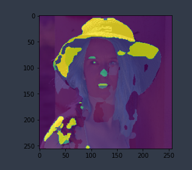

# segmentation

Image segemantation for photography purposes.

## Overview

Used the `CelebA-HQ` image database to train Segnet using keras2.0 in jupyter notebook. Given a image expecting a segmentation
output like in this example (and hopefully better):

## Project Structure

* `catalog.csv` - used to map images to their annotations
* `notebooks` - folder containing training notebook(s) for jupyter
* `models` - current models
* `scripts` - helper conversion scripts, mainly used to convert `CelebA-HQ` database from text to csv which is parseable with pandas framework

## Credits

 * Great large-scale celebs photo images database: https://github.com/switchablenorms/CelebAMask-HQ
 * https://github.com/namakemono/keras-segnet
